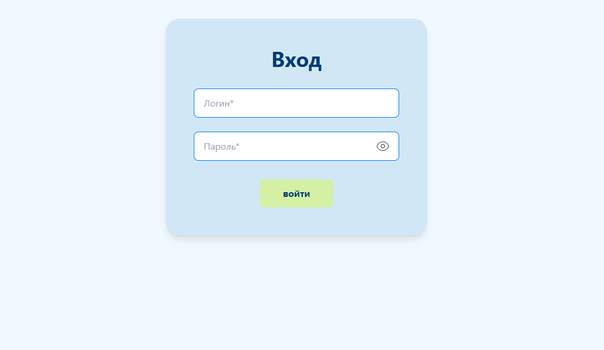

# SYSTEM MONITOR

> **Локальная система мониторинга состояния ПК**  
> Серверная FastAPI‑платформа + Python‑агент, отправляющий отчёты о состоянии клиентских машин.

---

## 🔍 Описание

На данный момент SYSTEM MONITOR — клиент‑серверное приложение с API на FastAPI и хранилищем в MongoDB.  
Система позволяет:
- Отслеживать загрузку CPU, RAM и список процессов;
- Получать отчёты от клиентских ПК в реальном времени;
- Хранить и обновлять статусы активности (Свободен / Занят / Неактивен);
- Управлять списком машин и пользователями;
- Создавать пользователей через CLI;
- Проверять доступность IP через `ping`.

---

## 🚀 Текущие возможности

- **Сбор метрик с ПК**: через локального Python-агента  
- **Отправка отчётов** на сервер каждые 5 секунд  
- **FastAPI сервер**: REST API для получения и анализа отчётов  
- **Хранение данных** в MongoDB (с индексами, автообновлением активности)  
- **Авторизация** через логин/пароль (bcrypt)  
- **Проверка доступности IP** через `ping` (при добавлении ПК)  
- **Автоматическая классификация статуса**: Неактивен / Свободен / Занят  
- **Создание пользователей** через CLI-утилиту `create_user.py`  
- **Контейнеризация**: Docker & Docker Compose  

---

## 🏗 Технологический стек

| Компонент       | Технологии                                         |
| --------------- | -------------------------------------------------- |
| **Backend**     | Python, FastAPI, Pydantic, pymongo                |
| **Realtime**    | REST API (FastAPI), Ping check                    |
| **База данных** | MongoDB, Docker Mongo service                     |
| **Аутентификация** | bcrypt, кастомный login‑flow                    |
| **Агент сбора данных** | psutil, requests, getpass                  |
| **Frontend**    | React/Vue/Angular + Tailwind CSS + Vite           |
| **Контроль версий** | Git, GitHub                                    |

---

## ⚙ Установка и запуск

# 1. Клонировать репозиторий
   - `git clone https://github.com/DARKLEGENT_AI/SystemMonitor.git`
   - `cd SystemMonitor`

# 2. Установить зависимости
   - `pip install -r requirements.txt`

# 3. Запустить MongoDB в Docker
   - `docker compose -f docker-compose.yml up -d --build mongodb`

# 4. Запустить API-сервер
   - `uvicorn main:app --host 0.0.0.0 --port 8000 --reload`

# 5. Создать пользователя (опционально)
   - `python create_user.py`

# 6. Запустить агент на клиентском ПК
   - `python pc_agent.py`

---

   - SYSTEM_MONITOR/
   - ├── main.py              # API-сервер (FastAPI, REST)
   - ├── create_user.py       # CLI для добавления пользователей
   - ├── pc_agent.py          # Агент мониторинга (отправка отчётов)
   - ├── requirements.txt     # Зависимости Python
   - ├── docker-compose.yml   # MongoDB сервис
   - └── site/                # Фронтенд (React/Vue/Angular + Vite)
